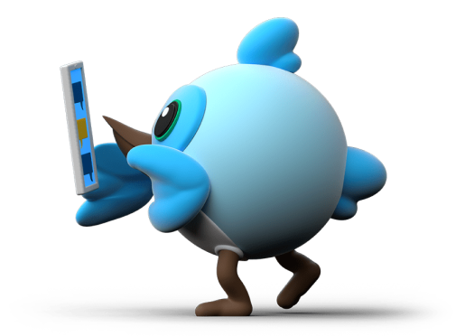

# Flutter Forward Extended
Flutter Forward is a conference for developers who want to learn about Flutter, the new mobile app SDK from Google. This repository contains the slides and code for the talks at Flutter Forward Extended.
 

## Talks

- Day 1: Introduction to Flutter
- Day 2: Dart Basics 
- Day 3: Flutter Meme Xylophone
- Day 4: Flutter Chat App 

> Flutter Forward Extended is a 4-day event. Each day, we will be releasing a new talk. Stay tuned!

# Note for Flutter Resources
- [Flutter Resources](https://github.com/Djsmk123/Flutter_Resources)

# Dash - Flutter Forward Extended

