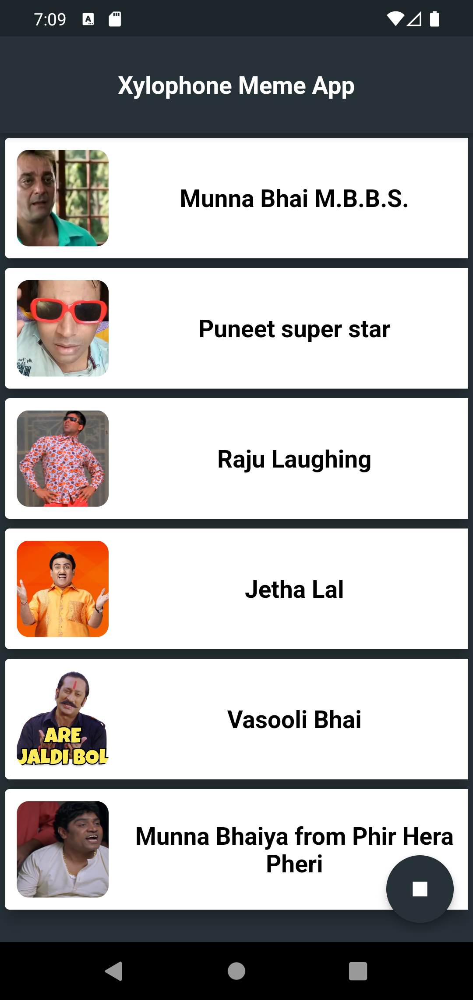

# Xylophone Flutter Forward 2023 
==============================

This is a sample app for the Xylophone Flutter Forward 2023 workshop.
Topic to be covered:
 - Flutter assets loading (Audio),
 - Flutter Widget ` Scaffold`,`Column`, `Expanded`,`FloatingActionButton`, `AppBar`, `Text`,`MaterialApp`,`ListView`,`ListView.builder`.
 - Flutter Pakcage `audioplayers`.
 - Flutter Stateful Widget `StatefulWidget`,`State`.
 
## Screenshots



## Prerequisites
- [Flutter](https://flutter.dev/docs/get-started/install) installed on your machine.
- [Android Studio](https://developer.android.com/studio) or [VS Code](https://code.visualstudio.com/download) installed on your machine. OR 
- [Vs Code](https://code.visualstudio.com/download) installed on your machine.
- Basic knowledge of [Dart](https://dart.dev/guides) and [Flutter](https://flutter.dev/docs).

## Getting Started
- Download assets from [here](https//github.com/djsmk123/xylophone-flutter-forward-2023/tree/master/assets).
- Create a new Flutter project.
  ```
    flutter create xylophone
    ```
- Copy the assets to the `assets` folder of your project.
- add the following dependencies to your `pubspec.yaml` file.
 ``` flutter pub add audioplayers```
- run flutter pub get

## Main.dart
In the `main.dart` file, add the following code.
```
import 'package:flutter/material.dart';
void main() => runApp(MyApp());

class class MyApp extends StatelessWidget {
  const MyApp({super.key});

  @override
  Widget build(BuildContext context) {
    return const MaterialApp(
      title: 'Xylophone',
      debugShowCheckedModeBanner: false,
      home: XyloPhone(),
    );
  }
}
```
## xylophone_screen.dart
- Create new folder screens in lib folder and create new file xylophone_screen.dart.
```
import 'package:audioplayers/audioplayers.dart';
import 'package:flutter/material.dart';

import '../constant.dart';

class XyloPhone extends StatefulWidget {
  const XyloPhone({super.key});

  @override
  State<XyloPhone> createState() => _XyloPhoneState();
}

class _XyloPhoneState extends State<XyloPhone> {
  final AudioPlayer audioPlayer = AudioPlayer();
  bool isPlaying = false;
  @override
  Widget build(BuildContext context) {
    //creating an instance of AudioPlayer
    //Scaffold widget that provides a default app bar, title, and a body property that holds the widget tree for the home screen.
    return Scaffold(
        backgroundColor: const Color(0XFF263238),
        //appBar widget that displays a toolbar at the top of the screen.
        appBar: AppBar(
          //backgroundColor property that sets the background color of the AppBar.
          backgroundColor: const Color(0XFF263238),

          centerTitle: true,
          toolbarHeight: 80,
          //title property that displays the title of the AppBar.
          title: const Text(
            'Xylophone Meme App',
            style: TextStyle(
              color: Colors.white,
              fontWeight: FontWeight.bold,
              fontSize: 20.0,
            ),
          ),
        ),
        //body property that holds the widget tree for the home screen.
        body: ListView.builder(
          //itemCount property that specifies the number of items in the list.
          itemCount: memes.length,
          itemBuilder: (context, index) {
            Map<String, String> meme = memes[index];
            // We can use [Inkwell] or [GestureDetector] or [MaterialButton] to detect the tap event.
            //difference between [Inkwell] and [GestureDetector] is that [Inkwell] has a ripple effect.
            //difference between [Inkwell] and [MaterialButton] is that [Inkwell] has a ripple effect and [MaterialButton] has a flat button.
            return InkWell(
                //Single tap event.
                onTap: () {
                  try {
                    audioPlayer.play(AssetSource(meme['audio']!));
                    setState(() {
                      isPlaying = true;
                    });
                  } catch (e) {
                    ScaffoldMessenger.of(context).showSnackBar(
                      const SnackBar(
                        content: Text('Error'),
                      ),
                    );
                  }
                },
                // for long press event [onLongPress] property is used.
                child: memeCard(meme));
          },
        ),
        floatingActionButton: stopButton());
  }

  Visibility stopButton() {
    return Visibility(
      visible: isPlaying,
      child: FloatingActionButton(
        backgroundColor: const Color(0XFF263238),
        onPressed: () {
          if (isPlaying) {
            setState(() {
              audioPlayer.stop();
              isPlaying = false;
            });
          }
        },
        tooltip: 'Stop',
        child: const Icon(
          Icons.stop,
          color: Colors.white,
        ),
      ),
    );
  }

  Card memeCard(meme) => Card(
        elevation: 10,
        child: SizedBox(
          width: double.infinity,
          height: 100.0,
          child: Row(
            children: [
              Expanded(
                flex: 1,
                child: Container(
                  height: 100.0,
                  margin: const EdgeInsets.all(10.0),
                  decoration: BoxDecoration(
                    color: Colors.white,
                    borderRadius: BorderRadius.circular(10.0),
                    image: DecorationImage(
                      image: AssetImage(meme['image']!),
                      fit: BoxFit.cover,
                    ),
                  ),
                ),
              ),
              Expanded(
                flex: 3,
                child: Container(
                  color: Colors.white,
                  child: Center(
                    child: Text(
                      meme['title']!,
                      textAlign: TextAlign.center,
                      style: const TextStyle(
                        color: Colors.black,
                        fontSize: 20.0,
                        fontWeight: FontWeight.bold,
                      ),
                    ),
                  ),
                ),
              ),
            ],
          ),
        ),
      );
}

```
## constants.dart
- Create new folder constants in lib folder and create new file constants.dart and this file will contain all the constants used in the app.

```

List<Map<String, String>> memes = [
  {
    'title': 'Munna Bhai M.B.B.S.',
    'image': "assets/images/munna_bhai.jpg",
    'audio': 'audio/munna_bhai.mp3'
  },
  {
    'title': 'Puneet super star',
    'image': "assets/images/puneet_superstar.jpg",
    'audio': 'audio/puneet_superstar.mp3'
  },
  {
    'title': 'Raju Laughing',
    'image': "assets/images/raju_laugh.jpg",
    'audio': 'audio/raju_laugh.mp3'
  },
  {
    'title': 'Jetha Lal',
    'image': "assets/images/jetha.webp",
    'audio': 'audio/jetha.mp3'
  },
  {
    'title': 'Vasooli Bhai',
    'image': "assets/images/vasooli.png",
    'audio': 'audio/vasooli.mp3'
  },
  {
    'title': 'Munna Bhaiya from Phir Hera Pheri',
    'image': "assets/images/munna_bhaiya.jpg",
    'audio': 'audio/munna_bhaiya.mp3'
  }
];

  ```

## Run the app
- Run the app using the following command.
```
flutter run
```
- If you are using an emulator, you can use the following command to run the app.
```
flutter run -d emulator-5554

```

> Clone the repo and run the app on your machine.


